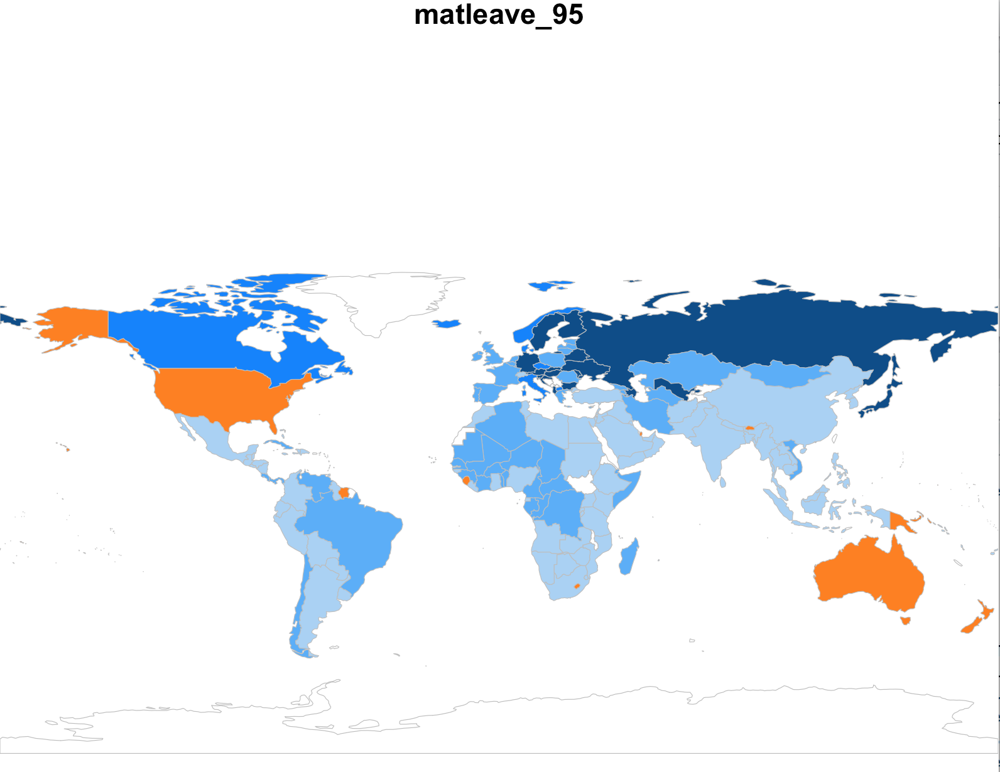
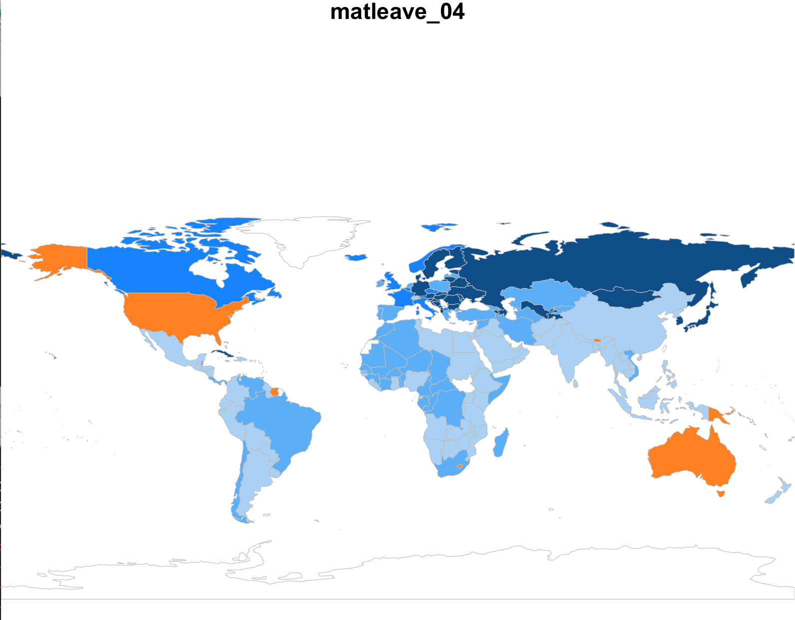
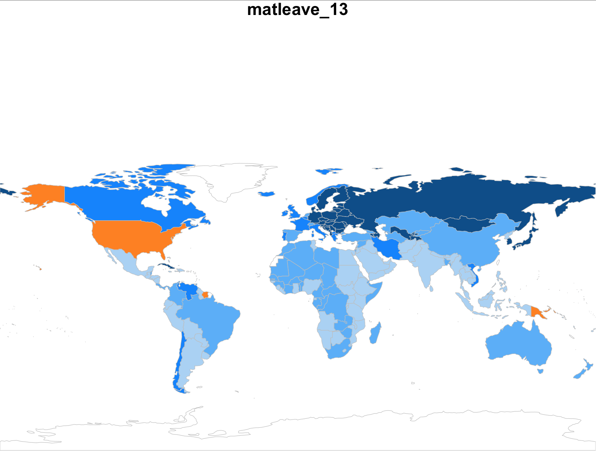
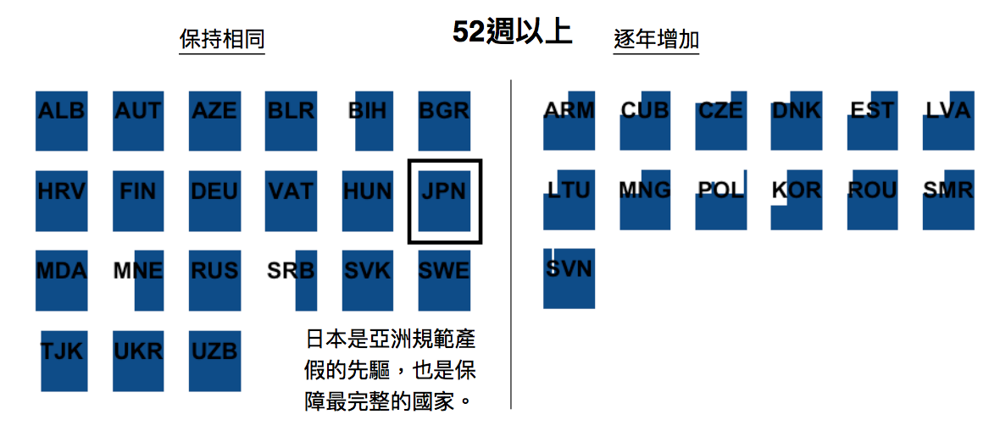
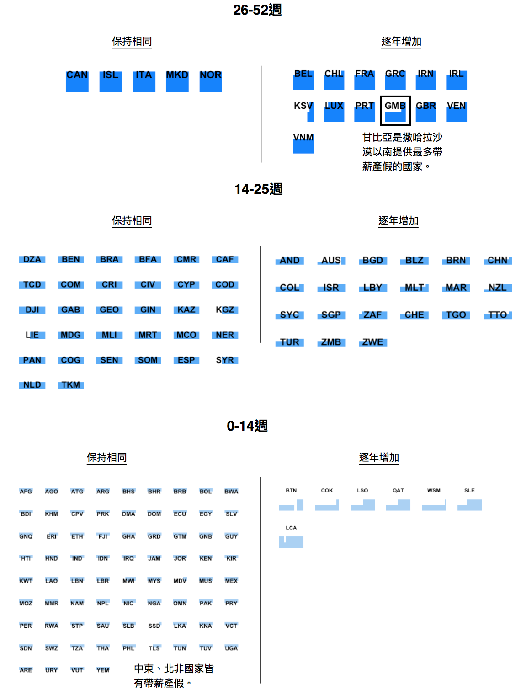
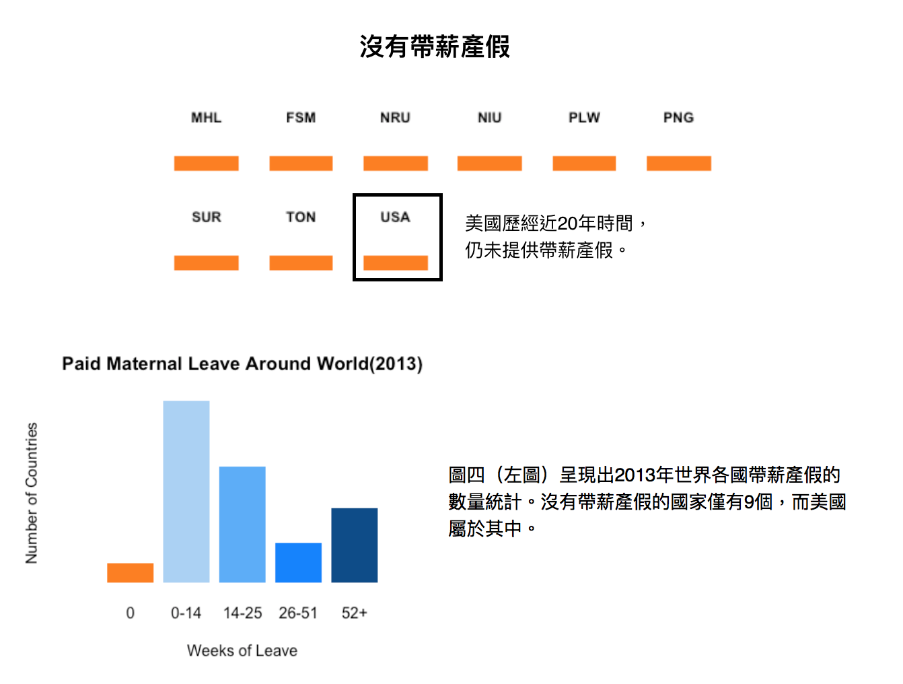
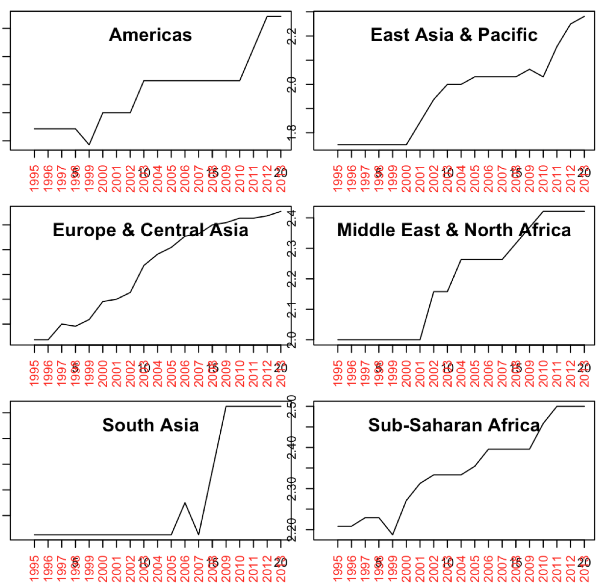

# 全球帶薪產假(Paid Maternal Leaves)趨勢分析

### 全球比一比：帶薪產假福利，哪一國進步最快？

-    圖表上顏色越偏深藍色的國家，表示帶薪產假（Paid Maternal Leaves）數量越高，社會福利相對完整；橘色則是沒有帶薪產假保障的國家。
-    比對1995、2004、2013年，透過顏色深淺的轉變，可看出各國在1995-2013年間帶薪產假福利增加的情形。

1995 年

2004 年

幾乎所有非洲國家已立法保障產假，南韓、蒙古、南非等經濟起飛的國家也提升了產假週數，但**美國、澳洲**這兩個相對富裕且倡導民主自由的國家，仍沒有給予帶薪產假。

2013 年

到了2013年，可明顯看出歐洲在產假數量的調整上大為提升，歐洲、俄羅斯是產假保障最為完整的區域，非洲、亞洲也已大致完成產假的規範。但，歷經近20年的時間，美國依然沒有帶薪產假。

### 1995-2013年間各國產假數量變化趨勢圖

以直方圖呈現至2013年各國（以`國家代號`表示）產假週數，共分為5個等級：
  * `52週以上`
  * `14-25週`
  * `0-14週`
  * `沒有帶薪產假`

這五類中，根據逐年變化情形，再分為2個類別：
  * `保持相同（StaySame）`
  * `逐年增加（Increasing）`

### 全球比一比：各大洲帶薪產假的變化趨勢

討論：
* 整體而言，各大洲帶薪產假的數量都呈現增長趨勢。
* 美洲自1999年起逐年增加。
* 東亞和太平洋國家也從2000年起開始增長。
* 歐洲一直以來都維持上升趨勢。
* 中東、北非自2001年起開始增加。
* 南亞約2007年起大幅增加。
* 撒哈拉沙漠以南的國家則是從1999年起開始向上提升，早於中東、北非。